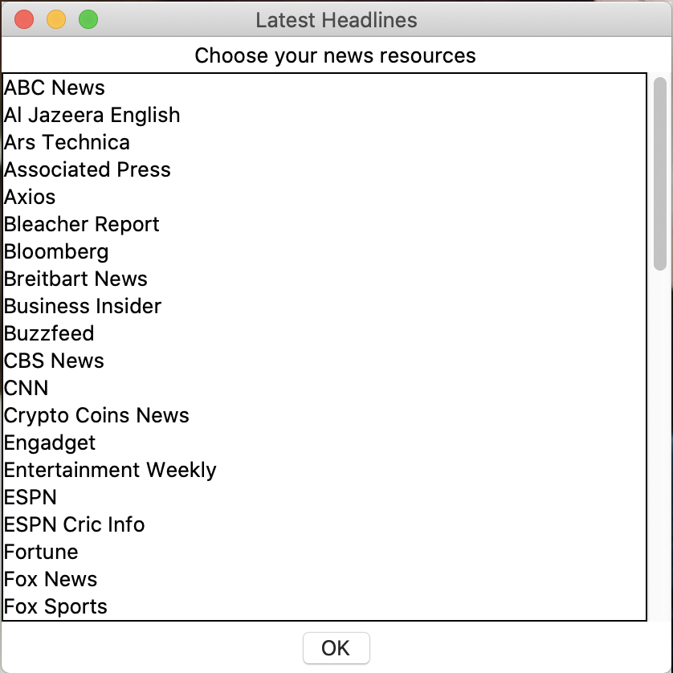
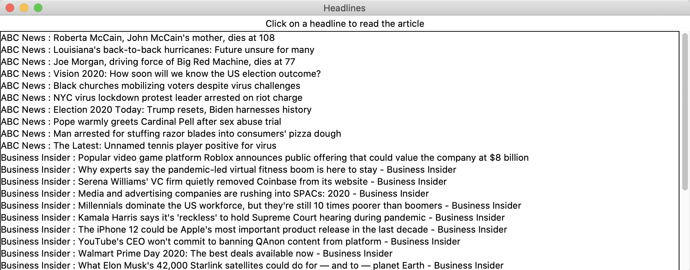

# News Headlines Fetcher

### Web API access, multithreading, multiprocessing, review of iterables and GUI

- Step 1: Fetch data with API calls from the [URL](https://newsapi.org/)
- Step 2: Build a GUI for user to choose new resources and
  **Choose News Resources**
  

- Step 3: Fetch News Headlines and URL
  **Click the Headlines and open new tabs in browser**
  

## lab4threads.py

- Multithreading

  After the user chooses their news sources , use **threads** to fetch the headlines from each source in order to display them in the display window.

## lab4processes.py

- Multiprocessing

  Change the method that the threads run into a function for the processes to run. Each process is for one news source, and each process sends the headline data back to the main process. The main process displays the data in the listbox.
